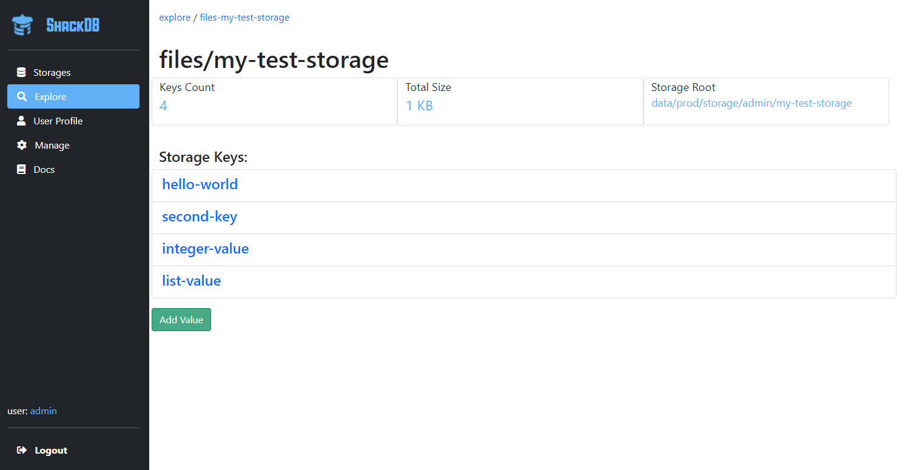
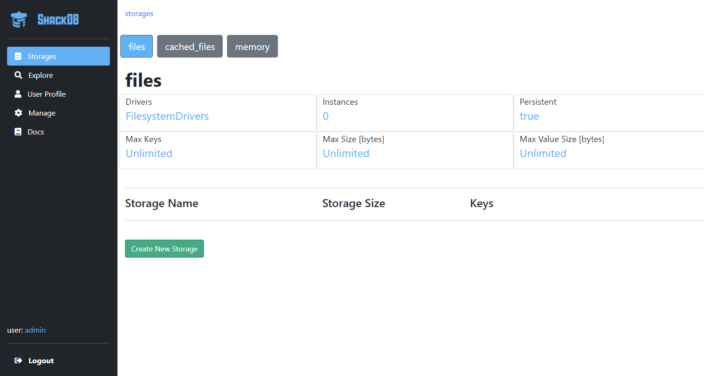
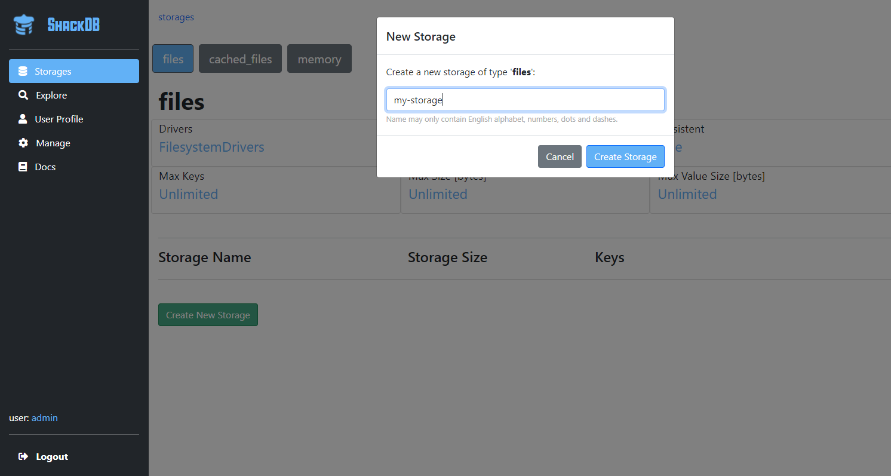
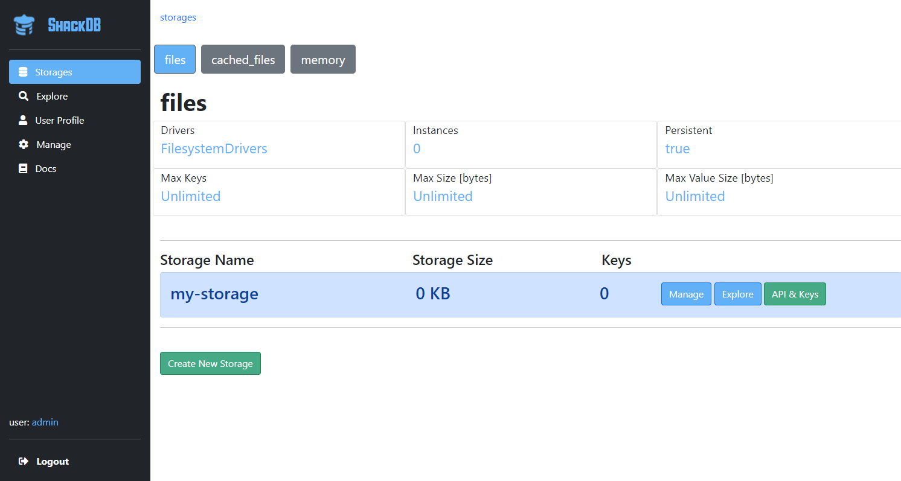
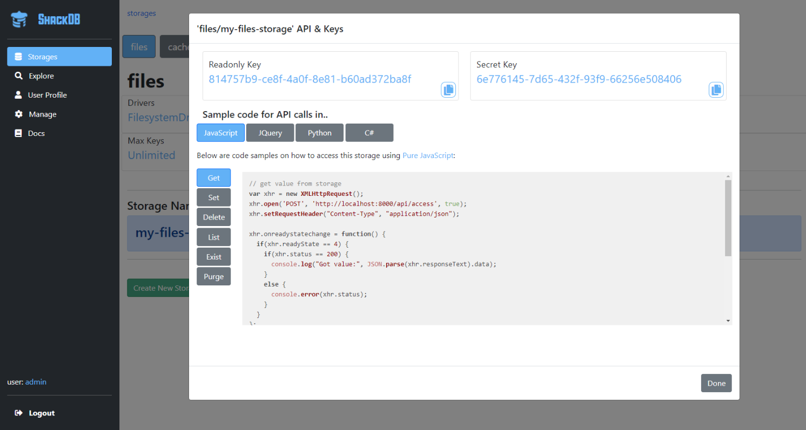

# ShackDB Docs

*ShackDB* is a *lean & mean key-value database*.

### Table Of Contents

- [Introduction](#introduction)
- [Getting Started](#getting-started)
- [Use Cases](#use-cases)
- [Configuration](#configuration)
- [Users](#users)
- [API](#api)
- [Security](#security)
- [Plugins](#plugins)
- [License](#license)


# Introduction

*ShackDB* is a minimalistic key-value storage with both persistent and in-memory storage types.
It provides a simple HTTP API, lots of security features, and user friendly web application to manage and explore storages.

In its core, the storage itself is extremely simple and consists of json files and dictionaries. What *ShackDB* provides is the wrapping around this; authentication, validation, storing metadata, convinient APIs, caching, and management web application.

*ShackDB* was an educational project to learn NodeJS, but it ended up good enough to be used for small to medium projects, including commercially. 

## Concepts

*ShackDB* is a lean, mean and secured key-value database, with different drivers for different requirements.

A storage can be persistent or in-memory (or use any custom drivers layer of your own making), and can have policies to limit the size, max keys, max value length, and other parameters of the storage.

Each storage has its own API keys, which you can distribute to different applications for different permissions, so that every application may only access the storages it need.

There are three types of API keys for storage access: 

* `api key`: a unique identifier for the storage - must be provided in all APIs. This is to hide the name of the storage and user from the API calls.
* `secret key`: a secret key that grants full read and write permissions.
* `readonly key`: a key that grants only reading permissions, for less trusted sources that should only read.

The storage APIs are HTTP-based and can be used from any language. The web pages contain examples in JavaScript, Python and C#.


## Web Pages

*ShackDB* comes with a built-in web application to manage and explore your storages. 
Its the easiest way to start using *ShackDB* and get the hang of it.

By default, it will be served on port 8000 once you start the server.




# Getting Started

## Installation

There are two ways to run a *ShackDB*: using *NodeJS* with source code, or with a portable distribution.

### With NodeJS

*NodeJS* is a JavaScript runtime commonly used for servers backend. 
You can run *ShackDB* with *NodeJS* by following these steps:

1. Install *NodeJS* (you can get it [here](https://nodejs.org/en/)). Recommended version is 14.17.x.
2. Fetch *ShackDB* code from NPM by running the command `npm install shackdb`.
3. From the newly created `shackdb` folder, run `start.bat`. 

If you run on linux or other non-windows OS, `start.bat` basically performs two actions: set NODE_ENV environment variable to "production", and execute `node` with `shackdb.js` as argument. You can emulate these commands on any OS.


### As Portable

*ShackDB* provides a portable version that does not require a *NodeJS* installation and can work out-of-the-box. This option is more suitable for production, especially if you want to install it on-premise.

The portable distributions are located under `/dist/` in the project's repository ([https://github.com/RonenNess/ShackDB](https://github.com/RonenNess/ShackDB)). 

To use it, unzip the version of your choice, and run `set NODE_ENV=production & node shackdb.js` or `start.bat` from cmd, just as you would with the *NodeJS* option.


## Using ShackDB

Once *ShackDB* is running you can test if its online by connecting to the web pages. Assuming you didn't change the default configurations, open any browser and enter `http://localhost:8000/`.

This should prompt the login page, you can use `admin` with password `admin123` (don't forget to change it later, see [here](#configuration) for details). 

After login you will be directed to the storages management page, which would look something like this:



Lets create a new storage with 'files' type. This storage will keep values as plaintext files. Click on the "Create New Storage" button and provide a unique name:



When done, you should see it in the list of storage instances:



Click on the "API & Keys" button to view this storage API keys and some code examples on how to use it (in JavaScript, C# and Python). To learn more about the API, visit [here](#api).

Alternatively, you can click on the "Explore" button to view the content of this storage (will be empty since its new) and set new values to it via the web UI. This is a great tool to test the storage functionality or debug values set by your applications.


# Use Cases

*ShackDB* is extremely useful when you need a lean and secured key-value storage, that is easy to setup and easier to use. Its great for sharing data between processes on different nodes, and useful as a "report back home" mechanism for apps deployed on client machines, using the secret-based API and limited storage features.

In this chapter we'll review few common scenarios and how to set them up with *ShackDB*. Be sure to also check out the [security](#security) section, to learn more on how to keep your server safe.

## Database

In its core, *ShackDB* is a simple key-value database. It doesn't have SQL or anything fancy, but its useful if all you need is to set json values quickly and via HTTP. To set as a database:

* Create a user and one or more persistent storages - every storage can be used for a different application or domain.
* Distribute the storage **secretKey** to all sources that need to write data. 
* Distribute the **readonlyKey** to sources that only need to read data.


## Cross-node Shared Memory

You can use *ShackDB* as a cross-node shared memory. This setup is very similar to the Database setup, except you use an in-memory storage type instead of a persistent one.


## Central Configuration System

*ShackDB* can be used as a central configuration system, where only selected sources can set values, and multiple untrusted clients can read from it. This is useful for on-premise solutions and client-side applications that you want to be able to configure remotely.

To screate a central configuration system, follow these steps:

* Create a user and a persistent storage.
* You can set and view configuration manually via the built-in web page.
* If you want an automatic processes or other clients to be able to change configuration - provide them with the **secretKey** of the storage.
* Provide all the applications that need to *read* the configuration with just the **readonlyKey** of the storage. These sources will now be able to read values, without setting them.
* If your **secretKey** falls to the wrong hands, you can regenerate it. However, this means you'll also need to re-distribute it to all the trusted sources.


## Caveats

*ShackDB* is not optimized to support large volumes. If you plan on storing millions of keys or huge values, you may need a different solution. 

Its best to keep individual values under 4MB, and storage instances under 10GB. It can work with more, just not very efficiently.


# Configuration

*ShackDB* configuration is defined in `config/app.json`. In new installations, the file would look something like this:

```json
{
    "paths": {
        "dataRoot": "data/prod",
        "usersDataRoot": "users",
        "storagesDataRoot": "storage"
    },

    "server": {
        "port": 8000,
        "securedPort": null,
        "hostname": "0.0.0.0",
        "enableWebPages": true,
        "apiUrl": "/api/"
    },

    "storageTypes": {
        "files": {"drivers": "./storage/lib/drivers/drivers_filesystem", "config": null, "policy": null, "cache": "dictionary"},
        "cached_files": {"drivers": "./storage/lib/drivers/drivers_cached_filesystem", "config": null, "policy": null, "cache": "dictionary"},
        "memory": {"drivers": "./storage/lib/drivers/drivers_memory", "config": null, "policy": null}
    },

    "usersStorageType": "files",

    "storage": {
        "keepMetadata": true,
        "usageStatsReportInterval": 600
    },

    "policies": {
        "example": {"maxSizeBytes": 1000, "maxKeys": 10, "maxKeyLength": 16, "maxValueSizeBytes": 500}
    },

    "caches": {
        "dictionary": {"class": "./storage/lib/cache/dictionary_cache", "config": {"maxKeys": 1000, "keysToReduceTo": 800}}
    },

    "security": {
        "maxFailedLoginAttempts": 20,
        "mustBeAdminToCreateUser": true,
        "privateKeyFile": null,
        "certificateFile": null,
        "authTokenMaxAgeSeconds": null,
        "cookiesSecret": "shacookie",
        "localhostManagementOnly": false
    },

    "users": [
        {
            "enabled": true,
            "username": "admin",
            "password": "admin123",
            "superuser": true
        }
    ]
}
```

Let's explore these options to understand them better.

### config.paths

Paths define prefix to add to all keys set in storage. 

- For filesystem-type storages, this will be the folder all the files will be written to.
- For memory-type storages, this is just a key prefix in the data dictionary.

These are the paths you can configure:

* `paths.dataRoot`: Root for all storage keys.
* `paths.usersDataRoot`: Root for the internal storage used to store users data, relative to `dataRoot`.
* `paths.storagesDataRoot`: Root for the storage data itself, relative to `dataRoot`.

Its best to leave these values as-is, unless you want to store the data files outside the *ShackDB* folder.


### config.server

Server-related settings.

* `server.port`: Which port to listen on for non secured http. Set to 'null' to disable http.
* `server.securedPort`: Which port to listen on for secured https. Set to 'null' to disable https.
* `server.hostname`: Hostname / ip to bind to.
* `server.apiUrl`: Root URL for all API routes. 


### config.storageTypes

A dictionary to define all storage types. Note that if you remove or change types that you already have instances of, these instances may break (depending on the type of change you make). 

Every key is the storage type identifier (and how you would reference this storage type when using the API) and value is a dictionary with the following options:

- *drivers*: path of a module to load the storage drivers class from, relative to server's root.
- *config*: optional config dictionary to pass to the drivers constructor.
- *policy*: optional policies to apply on storages of this type (policy types are defined under 'policies').
- *cache*: optional caching to use for storages of this type (cache types are defined under 'caches').

By default, *ShackDB* comes with three storage types:

```json
"files": {"drivers": "./storage/lib/drivers/drivers_filesystem", "config": null, "policy": null},
"cached_files": {"drivers": "./storage/lib/drivers/drivers_cached_filesystem", "config": null, "policy": null},
"memory": {"drivers": "./storage/lib/drivers/drivers_memory", "config": null, "policy": null}
```

- **files** will write values to simple json files, under the data folder. This is a persistent storage type.
- **cached_files** just like files storage, but batch changes and flush them to filesystem in background. This storage type respond a lot faster to write operations, but the price is that if the server goes down too soon after a change was made, it may get lost despite the user already getting ack.
- **memory** will write values to RAM. This storage type is not persistent.

The built-in drivers don't need any special configuration, which is why the config parameter is `null`.


### config.usersStorageType

Decide which storage type to use internally for the users metadata. By default, this should be the `files` storage (since users data is persistent).


### config.storage

Storage-related preferences.

* `keepMetadata`: If true, *ShackDB* will keep some metadata for every value set (for example modified time).
* `usageStatsReportInterval`: How often in seconds to write a report (to log) on storages API usage. Set to 0 to disable these reports.


### config.policies

Define storage policies to limit things like max keys, max size in bytes, etc. This value is a dictionary where the key is policy name, and the value is a dictionary with the following options:

* `maxSizeBytes`: Max storage size in bytes. Please note that this option have some performance impact.
* `maxValueSizeBytes`: Max size in bytes for individual values.
* `maxKeys`: Max number of keys we can store in this storage type.
* `maxKeyLength`: Max length for a single key.


### config.caches

Define caching layers you can attach to storage types. This value is a dictionary where the key is cache name, and the value is a dictionary with the following options:

- *class*: path of a module to load the cache class from, relative to server's root.
- *config*: optional config dictionary to pass to the cache class constructor.


### config.security

Security related features.

* `security.maxFailedLoginAttempts`: If user get the password wrong more than this number of times, user will be temporary locked.
* `security.mustBeAdminToCreateUser`: If true, only admins can create new users via the API or web pages.
* `security.authTokenMaxAgeSeconds`: For how long in seconds to keep users logged in. If undefined, authentication will only last for the duration of the session.
* `security.privateKeyFile`: Path of the private key file to use with HTTPS. Must be provided if `server.securedPort` is set.
* `security.certificateFile`: Path of the certificate file to use with HTTPS. Must be provided if `server.securedPort` is set.
* `security.cookiesSecret`: Optional cookies secret to set, to ensure cookies integrity.


### config.users

A list of built-in users to create automatically every time the server starts. This is especially useful if you only want to allow pre-defined static users. 

Every item in this array should be a dictionary with the following keys:

* `enabled`: Enable / disable this user.
* `username`: Unique username.
* `password`: User password.
* `superuser`: If true, this user will be an administrator.


# Users

In *ShackDB* you can't do anything without a user. Users provide isolation of storages and you need one to access to the web UI.

There are three ways to create users:

1. Define them in the app configuration file (`config/app.json`).
2. Via the web UI, if logged in as administrator.
3. Via the management API, if logged in as administrator.

Normally you'd want to create a set of predefined users via the config file, but if you need to create users dynamically you can do it from code or the web pages.

If you got to this section because you started a server and got an error about no valid users, try adding the following to `config/app.json` file:

```json
"users": [
    {
        "enabled": true,
        "username": "admin",
        "password": "admin123",
        "superuser": true
    }
]
```

This will create a user called `admin` with password `admin123` and admin privileges.


# API

There are two main APIs in *ShackDB*: the *storage API*, and *management API*. For simplicity, in this section we'll assume the default API urls were not changed (the `server.apiUrl` config). 

## Storage API

This API implement the main actions you can perform on the storage itself, using the API keys (either a `secret key` for full control, or a `readonly key` for readonly operations). 

This is the API you would normally use from your application code. You can view your storage API keys as well as some code examples in the web UI:



Note that all storage actions have the same endpoint, format, and must always be POST method. Lets review them:


### get

**Retrieve a value from storage.**

* Accepts: `secret key` / `readonly key`.
* Returns: {data: <retrieved data>, success: <was the operation successfull?> }
* If `retrieveMeta = true` and config is set to keep metadata, the call will also return the source and modification time of the data.

Pseudo code example:

```js
sendRequest({
    method: 'post',
    url: "<hostname:port>/api/access",
    data: {
        apiKey: "<storage-api-key>",
        readonlyKey: "<storage-readonly-key>", 
        // secretKey: "<storage-secret-key>", // can also use the secret key for this operation
        key: "<key-to-get>",
        retrieveMeta: false,
        action: 'get',
    }
});
```


### exist

**Checks if a value exists without returning it.**

* Accepts: `secret key` / `readonly key`.
* Returns: {exist: <true/false>, success: <was the operation successfull?>}

Pseudo code example:

```js
sendRequest({
    method: 'post',
    url: "<hostname:port>/api/access",
    data: {
        apiKey: "<storage-api-key>",
        readonlyKey: "<storage-readonly-key>", 
        // secretKey: "<storage-secret-key>", // can also use the secret key for this operation
        key: "<key-to-check>",
        action: 'exist'
    }
});
```


### set

**Set a value in storage.**

* Accepts: `secret key`.
* Returns: {success: <was the operation successfull?> }

Pseudo code example:

```js
sendRequest({
    method: 'post',
    url: "<hostname:port>/api/access",
    data: {
        apiKey: "<storage-api-key>",
        secretKey: "<storage-secret-key>",
        key: "<key-to-set>",
        data: {"hello": "world"},
        action: 'set'
    }
});
```


### update

**Update one or more keys of a dictionary value in storage.**

* Accepts: `secret key`.
* Returns: {success: <was the operation successfull?>, data: <updated data>, new: <was a new value created?>}

Pseudo code example:

```js
sendRequest({
    method: 'post',
    url: "<hostname:port>/api/access",
    data: {
        apiKey: "<storage-api-key>",
        secretKey: "<storage-secret-key>",
        key: "<key-to-set>",
        data: {"hello": "world"},   // <-- key and new value to set in dictionary
        action: 'update'
    }
});
```

The code above will take the value from '<key-to-set>' and set the key 'hello' under it to value 'world'. If the existing value doesn't exist, it will create it. But if it exist and not a dictionary, an error code (400) will be returned.


### delete

**Delete a value from storage.**

* Accepts: `secret key`.
* Returns: {deleted: <true/false>, success: <was the operation successfull?> }

Pseudo code example:

```js
sendRequest({
    method: 'post',
    url: "<hostname:port>/api/access",
    data: {
        apiKey: "<storage-api-key>",
        secretKey: "<storage-secret-key>",
        key: "<key-to-delete>",
        action: 'delete'
    }
});
```


### list

**List all keys in storage and return storage size.**

* Accepts: `secret key` / `readonly key`.
* Returns: {keys: <array of keys>, size: <total size in bytes>, success: <was the operation successfull?> }

Pseudo code example:

```js
sendRequest({
    method: 'post',
    url: "<hostname:port>/api/access",
    data: {
        apiKey: "<storage-api-key>",
        readonlyKey: "<storage-readonly-key>", 
        // secretKey: "<storage-secret-key>", // can also use the secret key for this operation
        action: 'list'
    }
});
```


### purge

**Purge all values from a storage, leaving it empty.**

* Accepts: `secret key`.
* Returns: {purged: <true/false>, success: <was the operation successfull?> }

Pseudo code example:

```js
sendRequest({
    method: 'post',
    url: "<hostname:port>/api/access",
    data: {
        apiKey: "<storage-api-key>",
        secretKey: "<storage-secret-key>",
        action: 'purge'
    }
});
```


### destroy

**Purge all values from a storage and delete the storage object itself.** Warning: the storage will become unavailable once this call ends.

* Accepts: `secret key`.
* Returns: {destroy: <true/false>, success: <was the operation successfull?> }

Pseudo code example:

```js
sendRequest({
    method: 'post',
    url: "<hostname:port>/api/access",
    data: {
        apiKey: "<storage-api-key>",
        secretKey: "<storage-secret-key>",
        action: 'destroy'
    }
});
```


### new_secret_key

**Generate and return a new secret key.** Warning: the old secret key will no longer work after this.

* Accepts: `secret key`.
* Returns: {newSecretKey: <new secret key>, success: <was the operation successfull?> }

Pseudo code example:

```js
sendRequest({
    method: 'post',
    url: "<hostname:port>/api/access",
    data: {
        apiKey: "<storage-api-key>",
        secretKey: "<storage-secret-key>",
        action: 'new_secret_key'
    }
});
```


### new_readonly_key

**Generate and return a new readonly key.** Warning: the old readonly key will no longer work after this.

* Accepts: `secret key`.
* Returns: {newReadonlyKey: <new readonly key>, success: <was the operation successfull?> }

Pseudo code example:

```js
sendRequest({
    method: 'post',
    url: "<hostname:port>/api/access",
    data: {
        apiKey: "<storage-api-key>",
        secretKey: "<storage-secret-key>",
        action: 'new_readonly_key'
    }
});
```


## Management API

The management API is used to control users, storage objects, authentication, and other actions that are required for the backend of the web UI. Its a mostly RESTful API. You can access this API programmatically to perform management operations or to create alternative web UI.

These APIs do not use the storages `secret key` or `readonly key`, but require authentication token cookie.

### /api/auth/login

This endpoint is used to authenticate users. It will return 200 status code on successful login, and provide an authentication token cookie to use in future requests.

Pseudo code example:

```js
sendRequest({
    method: 'post',
    url: "<hostname:port>/api/auth/login",
    data: {
        username: "<username>", 
        password: "<password>"
    }
});
```

### /api/auth/logout

Invalidate the authentication token of the currently logged-in user (based on authentication token cookie). It will return 200 status code and remove the authentication token cookie (in addition to invalidating it on server side).

Pseudo code example:

```js
sendRequest({
    method: 'post',
    url: "<hostname:port>/api/auth/logout",
});
```

### /api/users/

This endpoint is used to get all usernames. You must provide authentication token cookie to access this API.

Pseudo code example:

```js
sendRequest({
    method: 'get',
    url: "<hostname:port>/api/users",
});
```

### /api/users/username

This endpoint is used to manage a specific user instance. You must provide authentication token cookie to access this API (either of an admin, or the user itself).

Pseudo code example:

```js
// retrieve user data
sendRequest({
    method: 'get',
    url: "<hostname:port>/api/users/my_user",
});

// check if the user exists
sendRequest({
    method: 'head',
    url: "<hostname:port>/api/users/my_user",
});

// create a new user
sendRequest({
    method: 'post',
    url: "<hostname:port>/api/users/my_user",
    data: {email:"<email>", "password": "<password>"}
});

// update user's details
sendRequest({
    method: 'put',
    url: "<hostname:port>/api/users/my_user",
    data: {email:"<new email or null>", "password": "<new password or null>"}
});

// delete a user
sendRequest({
    method: 'delete',
    url: "<hostname:port>/api/users/my_user",
});
```


### /api/storages/type

This endpoint is used to manage all storage instances of a specific type and user. You must provide authentication token cookie to access this API (of the owner user).

Pseudo code example:

```js
// return a list with all storage ids of type files and the logged-in user
sendRequest({
    method: 'get',
    url: "<hostname:port>/api/storages/files",
});

// delete all storages of a type files and user
sendRequest({
    method: 'delete',
    url: "<hostname:port>/api/storages/files",
});
```

### /api/storages/type/id

This endpoint is used to manage a specific storage instance. You must provide authentication token cookie to access this API (of the owner user).

Pseudo code example:

```js
// retrieve a list of all keys in storage
sendRequest({
    method: 'get',
    url: "<hostname:port>/storages/files/my_storage",
});

// check if a storage exists
sendRequest({
    method: 'head',
    url: "<hostname:port>/storages/files/my_storage",
});

// create a new storage
sendRequest({
    method: 'post',
    url: "<hostname:port>/storages/files/my_storage",
    data: {email:"test@gmail.com", "password": "123456"}
});

// delete a storage
sendRequest({
    method: 'delete',
    url: "<hostname:port>/storages/files/my_storage",
});
```

# Security

This section provides tips on making *ShackDB* more secured.

## Isolation

Like any DB solution, its best to isolate *ShackDB* as much as possible. When deploying *ShackDB* on a server that only needs to access it locally, its best to block *ShackDB*'s ports from the outside world (view the firewall settings).

## Change default user

*ShackDB* comes with a default built-in admin user with password 'admin123'. For obvious reasons, its best to creare your own unique user and disable the built-in admin. 

## Specific hostname

Bind to a specific hostname rather than something general like '0.0.0.0' or '127.0.0.1' in the `server.hostname` config.

## Allow only HTTPS

Its recommended to enable HTTPS by providing a valid secured port (`server.securedPort`) and certificates (the `security.privateKeyFile` and `security.certificateFile` settings).

Once HTTPS is enabled, its best to disable HTTP by setting `server.port` to null, so that only secured communication is allowed.

## Disable anonymous users creation

If you don't need anonymous sources to be able to create new users via the API, its best to only allow admins to create users, by setting `security.mustBeAdminToCreateUser` to true.

## Cookies secret

*ShackDB* sign cookies with the secret defined in the `security.cookiesSecret` configuration. Use a unique string to make your cookies secured.

## Disable web pages

If you don't need the web pages to be available all the time, its safer to turn them off and only enable them when you need them for debugging and management. To do so, set `server.enableWebPages` config to false.

## Localhost management

You can lock the web pages and management API to only work from localhost (while still allowing remote access for storage access APIs). To do so, set `security.localhostManagementOnly` to true.


# Plugins

## Custom Storage Drivers

Its possible to register custom storage types into *ShackDB* without changing any of the source code. For example, lets say you want to create a new storage type that uses `MySQL` as the drivers layer - you can do this by implementing your own drivers class, and then register it as a new storage type.

First, you need to implement your own drivers class by inheriting from the class defined here: `.\server\lib\storage\lib\drivers\drivers.interface.js`.

The interface to implement is pretty straightforward and documented, so we won't repeat it here. Just be sure to adhere to the expected return types, and make your methods async (return promise) where they should be.

Once you implemented your drivers, you can put them anywhere under `server` folder. For example, a good place would be `server/plugins/my_drivers.js`.

Next, you need to register your custom storage type in the `app.json` config file. Add a new value to the `storageTypes` dictionary with the details of your new type.

For example, it might look like this:

```js
"storageTypes": {
    "files": {"drivers": "./storage/lib/drivers/drivers_filesystem", "config": null, "policy": null, "cache": "dictionary"},
    "cached_files": {"drivers": "./storage/lib/drivers/drivers_cached_filesystem", "config": null, "policy": null, "cache": "dictionary"},
    "memory": {"drivers": "./storage/lib/drivers/drivers_memory", "config": null, "policy": null}
    "my_storage": {"path": "./plugins/my_drivers", "config": null, "policy": null, "cache": null}  // <-- this is new
},
```

You can now restart the server and start using the new storage type. It will be listed in the web pages storage management page, and usable via the APIs with the unique identifier you picked.

## Custom Caching

Similar to how you can define custom storage drivers, you can also define custom cache layers. To do so, create your own cache class that inherits from the `ICache` interface defined here: `.\server\lib\storage\lib\cache\cache.interface.js`. Be sure to implement the API and return types properly.

Next, you can register your new cache type by adding an item to the caches dictionary:

```js
"caches": {
    "dictionary": {"class": "./storage/lib/cache/dictionary_cache", "config": {"maxKeys": 1000, "keysToReduceTo": 800}}
    "my_cache": {"class": "./plugins/my_cache", "config": {}}  // <-- this is new
},
```

And to start using your new caching class, simply set its key as the cache param of one of the storage types:

```js
"storageTypes": {
    "files": {"drivers": "./storage/lib/drivers/drivers_filesystem", "config": null, "policy": null, "cache": "my_cache"}
    // ....
}
```


# License

*ShackDB* is distributed with the GPLv3 license with reserved copyrights. This essentially means:

* You can use *ShackDB* for any commercial or non-commercial project.
* If you modify *ShackDB* and want to redistribute it, you have to make the modified version open source too (and GPL licensed).
* If you use parts of *ShackDB* code in your own projects, said projects have to be open source as well. Even if you modify the code.

To learn more about the license, read the attached LICENSE file.